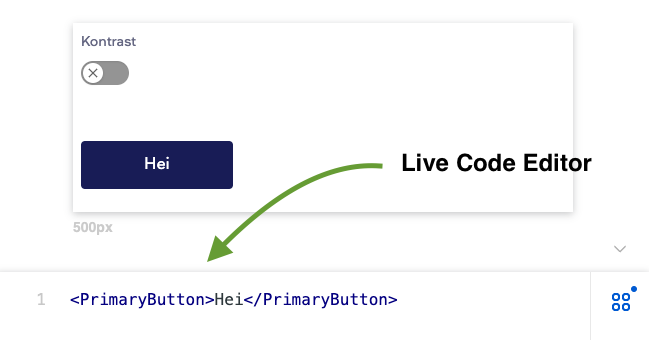
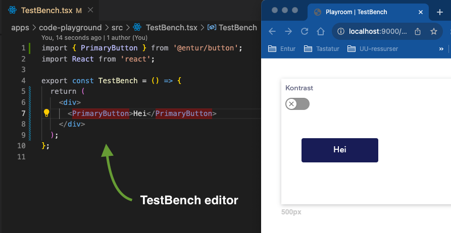

# Entur Designsystem ✨

Entur Designsystem is a collection of resources and guidelines for developing and creating material within the Entur brand. It is an internal tool with the goal of improving efficiency and consitency accross all of Entur's products.

## Table of Contents

1. [Intro](#intro)
2. [Requirements](#requirements)
3. [First time setup](#first-time-setup)
4. [Usage](#usage)
5. [Publish packages to npm](#publish-packages-to-npm)
6. [Using the documentation site](#using-the-documentation-site)
7. [Useful scripts](#useful-scripts)
8. [Hosting, CI, analytics etc.](#hosting-ci-analytics-etc)

## Intro

The Design system provides guidelines on colours, typography and more, methodologies for how to gain user insight, reusable components for both Figma and React, illustrations and icons, and material for presentations etc.

This monorepo contains all npm packages released by Entur Designsystem, as well as the [documentation site](design.entur.no) and a code playground for local testing.

The monorepo is divided into `packages` and `apps`. `packages` contains all packages we release to npm. `apps` contains services that use the components and utils under `packages`, in our case the documentation and a code playground for local testing.

## Requirements

The monorepo needs the following tools to run properly:

- Node.JS 16.17.0
- yarn 1.22.19
- npm (for publishing)
- MacOS???

Node.js is available on [Node's website](https://nodejs.org/en/download). If you want to easily switch between different versions of Node.js (different repos might use different versions) then [nvm](https://github.com/nvm-sh/nvm) is a good alternative.

Yarn can easily be installed with e.g. [npm](https://classic.yarnpkg.com/lang/en/docs/install/#mac-stable) or [brew](https://formulae.brew.sh/formula/yarn#default).

## First time setup

_NOTICE: these instructions are for MAC OS_

### Cloning the repo from GitHub

The repo is available at [GitHub](https://github.com/entur/design-system). To clone it you need to set up an ssh key on you mac and add the public key to you GitHub account (i.e. authenticate your computer). If you've already done this, you can skip the next step

- Follow [GitHubs guide](https://docs.github.com/en/authentication/connecting-to-github-with-ssh) on how to set up you ssh key connection

After you ssh key is set up, run the following script:
`git clone git@github.com:entur/design-system.git`

Alteratively, click the `clone` button on the GitHub repo page and follow the instructions.

### Install dependencies and build packages

If it is your first time developing in the repository, please run `yarn setup`. It will install dependencies and build all components.

If this works, great! If not, ask an adult for help …

### npm

You also need to set up access to entur on npm to publish the packages.

- Firstly, someone needs to add you to the [entur npm organisation](https://www.npmjs.com/org/entur). Ask someone in designsystem or selvbetjent, or on #talk-platform on Slack.
- Within npm you also need to set up 2FA (two-factor authentication). You will not be able to publish to npm without this security feature set up.
- Then, you need to log in to you npm account in the CLI (the terminal).
  - Run `npm login` in you terminal. Fill inn you username, password and other required information
  - Done

## Usage

### Development of packages

All packages are located under `packages/`. They are published under `@entur/[packagename]` where `[packagename]` is the foldername under `packages/`, eg. button. Se a complete list on [npm](https://www.npmjs.com/org/entur).

Start by creating a branch for your fix or feature. The branch should ideally start with the Jira issue id, eg. ETU-38373-branch-name. When fixing bugs or adding new features to a package, it is recommended to live preview and test the component using the code-playground. The code-playground uses `playroom` ([available from npm](https://www.npmjs.com/package/playroom)) to live preview your code. Start the code-playground using `yarn start:code-playground` and start watch mode for the package using `yarn start:package [packagename]`. The last script is necessary to reflect your code changes in the code-playground. Alternatively, you can use the script `yarn start:code-playground-for-package [packagename]` to start both the code-playground and watch mode for [packagename].

Test code can either be written in the built in editor in code-playground or using the `TestBench.tsx` under `apps/code-playground/src` ([se image below](#editor-images)). If you want to use state or other more complex logic in your testing, you need to use the `TestBench.tsx` file.

|  |  |
| ------------------------------------------------------------------------------------ | ----------------------------------------------------------------------- |
| Built in code editor in code-playground                                              | TestBench file in VSCode editor                                         |

### Commiting your changes

Since the commits made are used both as a changelog and to track wether we are releasing a patch, minor, or major version ([see conventional-commits](https://www.conventionalcommits.org/en/v1.0.0/)), we need to make sure commits are written correctly. To do this, we use [Commitizen](https://github.com/commitizen/cz-cli) which lets us build a correctly formated commit message and lint it for errors. As an extra meassure, all new commitmessages are also linted on `git push` to make sure we aren't forgeting proper formating (_NOTICE: can be overridden using HUSKY=0_).

When your feature or bugfix is done, stage your changes and commit them using `yarn gc:format`. This activates Commitizen and makes sure commits are written with proper formating.

How to fill in commit message:

1. **type** should be selected based on ([conventional-commits](https://www.conventionalcommits.org/en/v1.0.0/))
2. **scope** should contain the component or package affected in small letters with space, eg. square button
3. **short description** is one sentece about which change this will add, always in imperative form, eg. add new button type duodenary
4. **long description** is for when more info might be needed to explain the fix/feature
5. **breaking changes** should contain info about all breaking changes made in this commit, i.e. changes that might make existing usage not work anymore
6. **issues closed** can be skipped
7. **affected packages** should automatically be correct. Just confirm with enter

No errors? Great! Otherwise, try again …

### Tl;dr

1. You want to add a feature to `[packagename]`, eg. button
2. Create a branch for the fix/feature
3. Run `yarn start:code-playground` and `yarn start:package [packagename]`.
4. Make your changes in `packages/[packagename]`.
5. Watch you changes live on `localhost:90000`
6. Stage your changes and commit with `yarn gc:format`
7. Push your changes to GitHub

## Publish packages to npm

To publish packages you need have set up npm with Entur, see [the npm section](#npm) on how to do this.

It's first when a package is published to npm that others can use it. This makes it possible to batch several fixes and features into one release. Find a golden mean between the more error prone rapid publishing and a more safe slow publishing schedule strategy. Remember that others rely on your components to work correctly but they can't use them before you publish them them.

### Publishing a normal version

To publish you changed packages do the following:

1. run the `yarn publish-packages` script
2. check that package versions are as expected and confirm with enter
   1. _NOTICE: all packages dependent on changed packages will be bumped on patch version_
3. Next, all packages will be built, tested and linted in the background. The terminal might look frozen but just wait. More changed packages == more wait time.
4. When asked to input a one-time password, enter you two-factor authentication code for npm.
5. Done! You should see a summary of published packages

### Publishing a prerelease version

If you want to have others test your changes before you officially release them, you can publish a beta prerelease of the package. This will have the "next" tag instead of "latest" and include a beta-suffix.

1. run the `yarn prerelease-packages` script
2. check that package versions are as expected and confirm with enter
   1. NOTICE: all packages dependent on changed packages will be bumped on patch version
3. Next, all packages will be built, tested and linted in the background. The terminal might look frozen but just wait. More changed packages == more wait time.
4. When asked to input a one-time password, enter you two-factor authentication code for npm.
5. You packages can now be downloaded from npm with their beta-version
6. When you finally want to go from a beta to a official release, run the `yarn graduate-packages` script and follow follow the same steps for release as before.

### My publishing failed

If you publishing failed during one of the release scripts you might end up with a dirty state where tags are pushed to `master` but not published to npm. To fix this, try running the `yarn publish-packages-after-failed-attempt` script. You might need to discard `package.json`-changes first.

Should that not work, you have to manually remove tags pushed to master and reset the publish commit before trying a new publish. The following commands might helt.

_WARNING: These commands rewrite history on master and should not be used carelessly!_

```bash
// delete all tags from previous commit on master
$ git tag -l --contains HEAD~1 | xargs git push --no-verify --delete origin
```

```bash
// replaces local tags with those on master
$ git tag -l | xargs git tag -d
$ git fetch --tags
```

```bash
// delete last commit both locally and on master
$ git reset --hard HEAD~1 && git push --force-with-lease
```

## Using the documentation site

The documentation is built using [Gatsby](https://www.gatsbyjs.com/).

The content of the various documentation pages can be found in the `pages` folder under `apps/documentation/src`. Each page is placed in folders based on which part of the page it belongs to, and each of the files is in the `MDX` format. Read more about MDX on [MDX's pages](https://mdxjs.com/).

For the component documentation, an attempt has been made to standardise the appearance and structure of each page. Feel free to copy an existing file if you are adding a new page.

### Frontmatter – metadata for the documentation page

The site uses `frontmatter` at the top of each documentation page file (see the code example that follows). This is meta-information for the documentation page and can be the title of the page, which NPM package this component belongs to, in what order it should appear and in which menu etc. Frontmatter is formatted in `yaml`.

The following options are available in the frontmatter YAML:

```yaml
title: Title of the page
route: /url/to/page
order: 1
parent: Main category (Components, Getting Started etc)
menu: Which submenu (only relevant for components pages)
npmPackage: name of the npm package (only relevant for components pages)
tags: searchable, words (only relevant for components page)
```

There are a couple of others too, but you probably never need to worry about them. When in doubt, take a look at the source code.

### Components and utils for the documentation page

If you need to change something on the documentation page itself, or create some special components to document something, then the code for this should be under `apps/documentation/src`. This could be code for live demonstration of Designsystem components, utils, page structure (header and footer) etc.

- `utils` contains utilities that are used across the page
- `components` contains a number of reusable internal documentation page components. These are used both in the actual page structure and as helper components in documentation, e.g. Playground.

## Useful scripts

### Build

| script                     | description                                    |
| -------------------------- | ---------------------------------------------- |
| `yarn build:packages`      | Build all npm-packages                         |
| `yarn build:documentation` | Build documentation site                       |
| `yarn build:all`           | build both documentation site and npm packages |

### Watch / development mode

| script                                                 | description                                                                    |
| ------------------------------------------------------ | ------------------------------------------------------------------------------ |
| `yarn start:package [packagename]`                     | Watch mode for package \[packagename\], eg. button                             |
| `yarn start:documentation`                             | Watch mode for documentation site                                              |
| `yarn start:code-playground`                           | Start the code playground software                                             |
| `yarn start:code-playground-for-package [packagename]` | Start the code playground software and watchmode for [packagename], eg. button |

### Test and lint

| script                            | description                                  |
| --------------------------------- | -------------------------------------------- |
| `yarn test`                       | run Jest tests for all packages              |
| `yarn test:package [packagename]` | run Jest tests for [packagename], eg. button |
| `yarn lint`                       | run linter on all packages and documentation |

### Commits and release

_NOTICE: the commit linter Husky can be ignored with `HUSKY=0` before your script, eg. `HUSKY=0 yarn gc:format` or `HUSKY=0 git push`._

| script                                       | description                                                                    |
| -------------------------------------------- | ------------------------------------------------------------------------------ |
| `yarn gc:format`                             | run commit formater for structured commits                                     |
| `yarn release-packages`                      | publish new versions of packages to npm based on conventional-commits          |
| `yarn prerelease-packages`                   | publish new beta-versions of packages to npm based on conventional-prerelease  |
| `yarn graduate-prerelease-packages`          | publish official releases of all beta-packages                                 |
| `yarn publish-packages-after-failed-attempt` | try this when something goes wrong during publish with `yarn release-packages` |

## Hosting, CI, analytics etc.

### Firebase

Entur Designsystem documentation is hosted on Firebase hosting as a static site. [Link to project](https://console.firebase.google.com/u/0/project/entur-design-system/hosting/sites/entur-design-system).

### GitHub Actions

Entur Designsystem uses GitHub Actions and workflow to automatically deploy the documentation to firebase.
When a PR is made the `build-test-and-deploy-preview.yml` starts that builds, tests and lints the packages, then builds the documentation and creates a preview channel in Firebase Hosting. A GitHub-bot adds preview-link as a comment in the PR.
When push and merge to main the `build-and-deploy-prod.yml` starts and builds, tests, and lints the packages, then builds the documentation and deploy the website to production in Firebase Hosting.

### PostHog

Entur Designsystem documentation is connected to PostHog to provide analytics about our users. The data collected is anonymous and does not uses cookies etc. [Link to project](https://eu.posthog.com/home).

## Contributing

Want to contribute? Great! Follow the [usage](#usage) guide and make a PR with you changes. To not waste your own time, it's recommended you contact the designssystem team beforehand directly or via Slack ([#talk-designsystem](https://entur.slack.com/archives/CMTU7MY3V)) to make sure the feature/fix is wanted.

A more thorough explanation can also be found [here](https://design.entur.no/kom-i-gang/for-utviklere/bidra) (in norwegian only).
