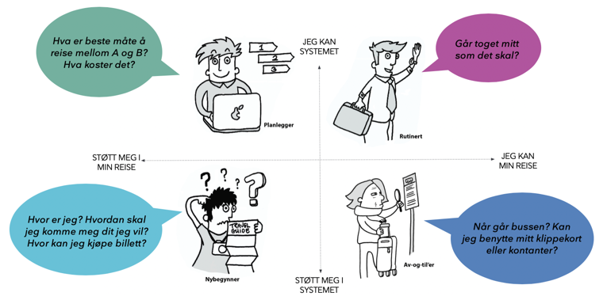

import PageHeader from '~/components/PageHeader';
import reisebehov from './images/reisebehov.png';

<PageHeader>
  Enturs tjenester har to hovedbrukergrupper; reisetilbydere på den ene siden og
  de reisende på den andre. Vår stategi er tydelig på at den første gruppen er
  vel så viktig for vårt oppdrag som den andre.
</PageHeader>

### Reisetilbydere

Tilbydere på den ene siden får en plass å formidle tilbudene sine til konsumenter på den andre. For at Entur skal kunne levere troverdige tjenester til de reisende er det helt nødvendig at vi også leverer funksjonelle og presise tjenester til reisetilbyderne. Reisedataene som vi samler inn er åpent tilgjengelige for alle seskaper og utviklere som vil benytte dette i egne tjenester.

### De reisende

Entur skal levere tjenester som gjør det enkelt å planlegge, sammenligne og kjøpe sømløse reiser på tvers av alle reisetilbydere i Norge.

De reisende er ikke en homogen gruppe, og enkeltindidiver vil heller ikke kunne deles inn i tradisjonell måte med personas og personavhengige behov - vi har siden lengst slått fast at det er situasjonen man er i, og ikke personen som man er, som avgjører hvilke behov man har.

### Interne brukere

Mange av systemene vi lager i Entur benyttes av våre egne ansatte, f.eks. ESS (nytt navn kommer) som benyttes av kundebehandlere på Enturs Kundesenter og på betjente stasjoner. Her er likhet med kundeflatene i app og på web viktig, slik at en kundebehandler enkelt kan hjelpe kunder med reiser og billetter. Også systemer som Entur Partner har en intern brukergruppe, når folk hos oss hjelper reisetilbydere med dataforvaltning. Gjenbrukbare produkter (widget, SDK’er, API’er) sikrer funksjonslikhet og gjenkjennbarhet på tvers av systemer og gir trygghet og forståelse.

## Brukerhistorier

Man bør forsøke å bruke situasjonsbehov i formulering av brukerhistorier, i steden for personas. Noen ganger holder det med standardkategoriene ‘som en utvikler’ , ‘som en kundebehandler’ eller ’som en reisende’, men når det er til hjelp for å presisere behovet kan ‘som en reisende’ bli til ‘som en togpendler’.
