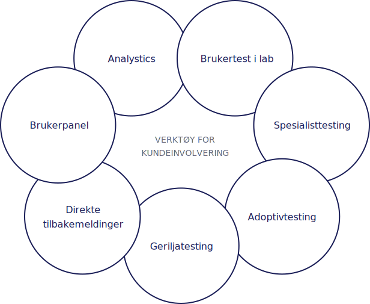

import PageHeader from '~/components/PageHeader';
import * as tokens from '@entur/tokens';
import { AddIcon, SubtractIcon } from '@entur/icons';
import { Heading4, Paragraph } from '@entur/typography';
import './brukertesting.scss';

<PageHeader>
  Hvordan skal man finne ut hva som virkelig betyr noe – og gjør en forskjell i
  ulike situasjoner - for de som anvender ens produkt?
</PageHeader>

Presis som at kundegruppene varierer, så vil også verktøyene som egner seg til innsikt i kundenes behov variere. Verktøykassen vi bruker spenner fra kvantitativ til kvalitativ. Noen av tiltakene gjennomføres sjeldent, andre regelmessig og hyppig og noen er kontinuerlig insats.

Generelt kan man si at alle metoder for kundeinnsikt overlapper og utfyller hverandre. Mange ganger må vi hente innsikt fra flere kilder for å kunne forstå problemene og fastsette behovet for tiltak. Her er et eksempel på verktøy som kan benyttes til kundeinvolvering:

## Direkte tilbakemeldinger

I app og web har vi lagt tilrette for at folk skal kunne melde inn direkte i flatene våre via et tilbakemeldingsskjema. Kundesenteret sorterer feedback, svarer tilbake og stiller flere spørsmål hvis det er nødvendig - og melder saken inn i Jira til riktig team. Vi samler også de anonyme meldingene i en Slack-kanal. De vanligste meldingene er feil i rutetider, mangel på konkrete reiseforslag, ønsker om nye funksjoner og billettprodukter samt bugs. Vi er takknemlig for denne typen feedback, da den fanger opp ting vi ikke ville ha oppdaget ellers.

  

    <Heading4 className="brukertesting-overskrift">
      <AddIcon inline /> Fordeler
    </Heading4>
    Vi kan teste i produksjon, med reelle data og på faktiske brukersituasjoner.
    Vi kan se kontekst for meldingen hvis meldingen kommer fra en resultatside, da
    vi lenker til søket. Det gir kvalitetssikring av produktet i ulike caser og kombinasjoner.
  

  

    <Heading4 className="brukertesting-overskrift">
      <SubtractIcon inline /> Ulemper
    </Heading4>
    Mange mennesker kan oppleve feil og mangler uten å melde fra, så vi kan ikke
    stole på dette som eneste kilde. De fleste melder fra om feil og bugs, det er
    vanskeligere å melde om ’småsaker’ og å formulere diffuse ønsker til forbedret
    brukeropplevelse.
  

## Geriljatesting

I app og web har vi lagt tilrette for at folk skal kunne melde inn direkte i flatene våre via et tilbakemeldingsskjema. Kundesenteret sorterer feedback, svarer tilbake og stiller flere spørsmål hvis det er nødvendig - og melder saken inn i Jira til riktig team. Vi samler også de anonyme meldingene i en Slack-kanal. De vanligste meldingene er feil i rutetider, mangel på konkrete reiseforslag, ønsker om nye funksjoner og billettprodukter samt bugs. Vi er takknemlig for denne typen feedback, da den fanger opp ting vi ikke ville ha oppdaget ellers.

  

    <Heading4 className="brukertesting-overskrift" margin="bottom">
      <AddIcon inline />
      Fordeler
    </Heading4>
    <Paragraph>
      Enkelt å gjennomføre, og kan med fordel utføres av flere i teamet. Man kan
      teste på ulike stadier, men kanskje fremst variasjoner i skisser. Desidert
      raskeste tilbakemelding på nye funksjoner.
    </Paragraph>
  

  

    <Heading4 className="brukertesting-overskrift" margin="bottom">
      <SubtractIcon inline /> Ulemper
    </Heading4>
    Kan gi litt impulsive svar, eller mangle dybde. Kvaliteten på svarene varierer
    ut fra om testpersonen kan relatere til testcasen eller ikke. Kan være vanskelig
    å treffe relevante testpersoner.
  

## Adoptivtesting

Dette er en metode som vi utviklet da vi begynte å jobbe med multimodal reiseplanlegging. Adoptivtesting er regelmessig testing på faste personer. Vi har videreutviklet metoden til ulike kanaler/produkter og med flere ulike team. Kanskje er dette noe flere gjør, og eventuelt kaller noe annet?

Metoden kan ofte bekrefte tidligere innsikt. For oss er det ofte adoptivtesting som bekrefter at det er dags å trekke frem og prioritere fra backloggen. Tilbakemeldingene fra de faste testpersonene blir ekstra påtakelig for alle som er med.

  

    <Heading4 className="brukertesting-overskrift" margin="bottom">
      <AddIcon inline /> Fordeler
    </Heading4>
    Personene reiser kollektivt og bruker produktet til vanlig. Vi tester på faktiske
    situasjoner og i reelle caser. Når vi følger de samme folkene over tid, lærer
    vi dem å kjenne sånn at vi bedre vet hvorfor hvorfor de svarer slik de gjør.
    Ypperlig som supplement og avsjekk etter annen testing eller direktemeldinger
    – eller som kvalitetssikring rett før vi pusher en ny funksjon ut i applikasjonen.
  

  

    <Heading4 className="brukertesting-overskrift" margin="bottom">
      <SubtractIcon inline /> Ulemper
    </Heading4>
    Få testpersoner kan gi lite variasjon i svarene. Vi tester på samme personer,
    og når ikke alltid de som trenger akkurat den funksjonen som skal testes mest.
  

