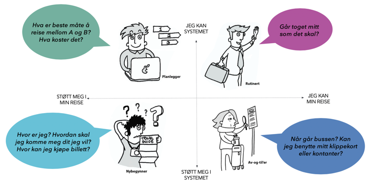

import PageHeader from 'src/components/PageHeader';
import reisebehov from './images/reisebehov.png';

<PageHeader>
  Enturs tjenester har to hovedbrukergrupper; reisetilbydere på den ene siden og
  de reisende på den andre. Vår stategi er tydelig på at den første gruppen er
  vel så viktig for vårt oppdrag som den andre.
</PageHeader>

## Reisetilbydere

Tilbydere på den ene siden får en plass å formidle tilbudene sine til konsumenter på den andre.

## De reisende

Entur skal levere tjenester som gjør det enkelt å planlegge, sammenligne og kjøpe sømløse reiser på tvers av alle reisetilbydere i Norge.

De reisende er ikke en homogen gruppe, og enkeltindidiver vil heller ikke kunne deles inn i tradisjonell måte med personas og personavhengige behov - vi har siden lengst slått fast at det er situasjonen man er i, og ikke personen som man er, som avgjører hvilke behov man har.

## Brukerhistorier

Man bør forsøke å bruke situasjonsbehov i formulering av brukerhistorier, i steden for personas. Noen ganger holder det med standardkategoriene ‘som en utvikler’ , ‘som en kundebehandler’ eller ’som en reisende’, men når det er til hjelp for å presisere behovet kan ‘som en reisende’ bli til ‘som en togpendler’.
